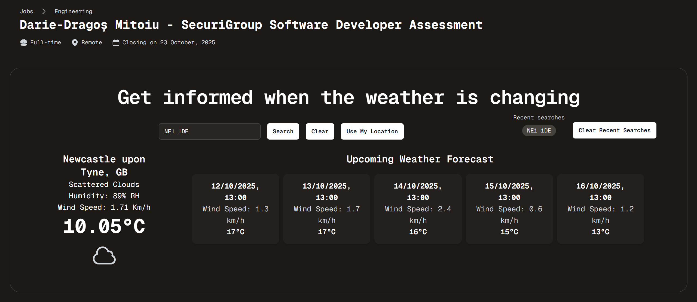

## Darie-Dragos Mitoiu - SecuriGroup Assessment

### Assessment - React/NextJS/TailwindCSS



#### Installing Packages

##### In Root Directory

##### Open PowerShell and Execute

```bash
npm install
```

##### In Client Directory

##### Open PowerShell and Execute

```bash
npm install
```

#### Run Instructions

##### In Root Directory

##### Open PowerShell and Execute

```bash
npm run dev
```

##### OR

##### In Separate PowerShell Instances

```
cd client
npm run start
```

#### Build Instructions

```
cd client
npm run build
```